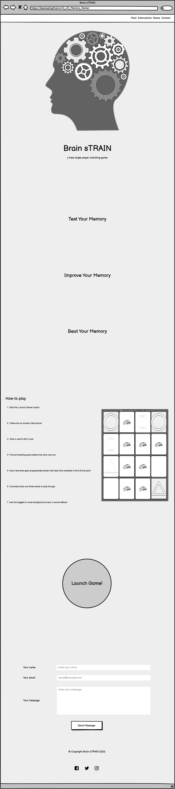
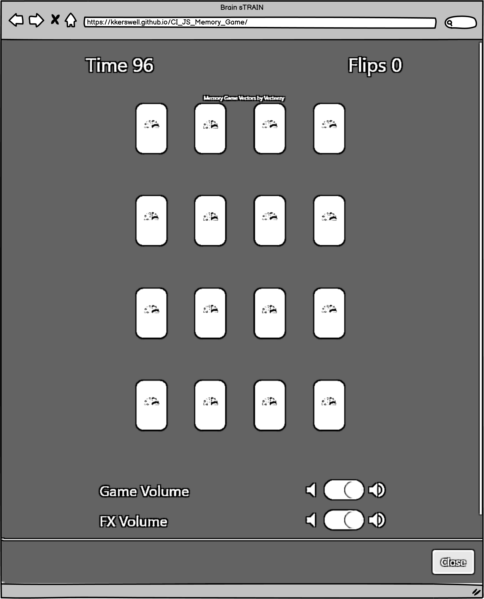
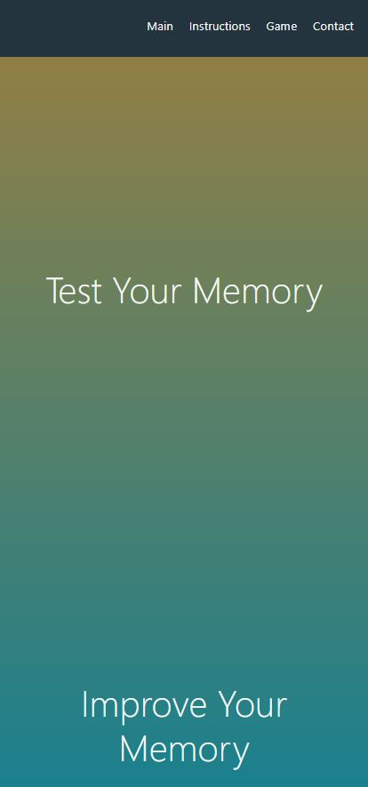
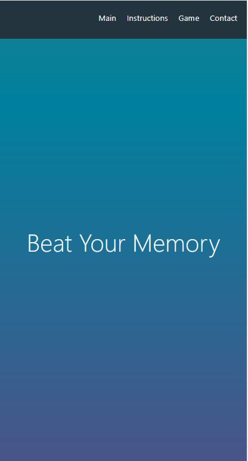
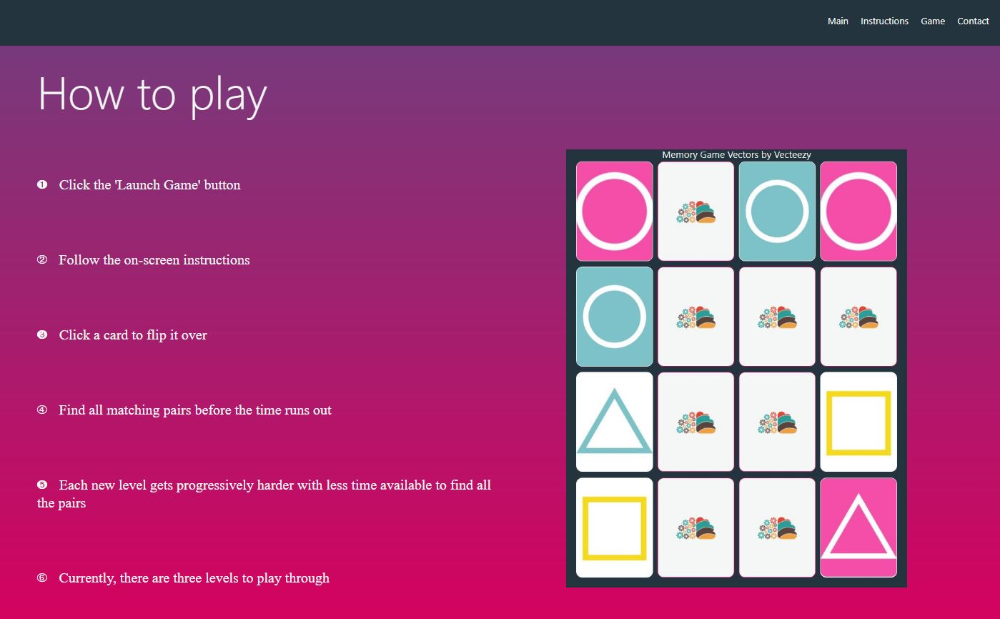
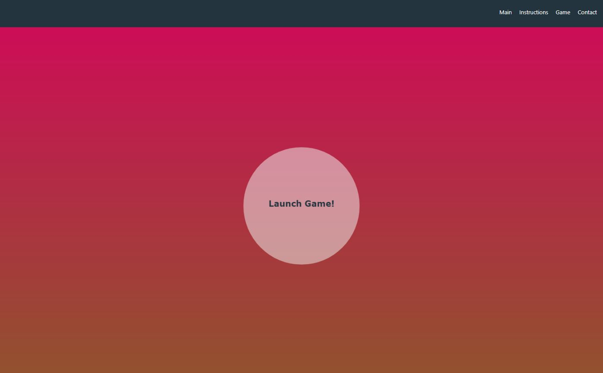
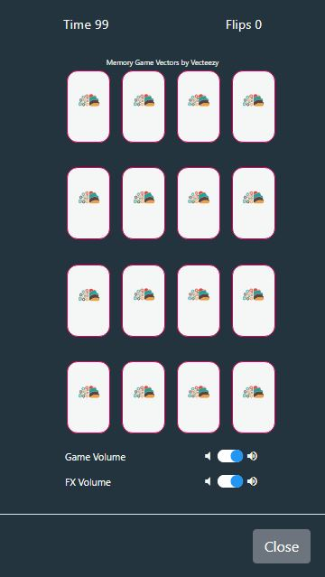
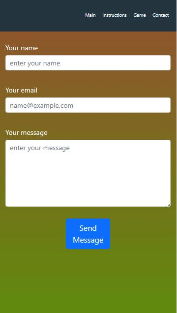
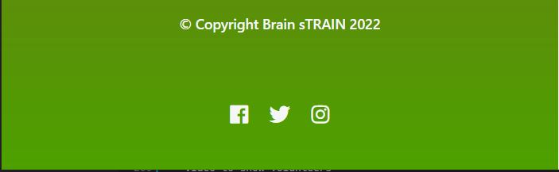
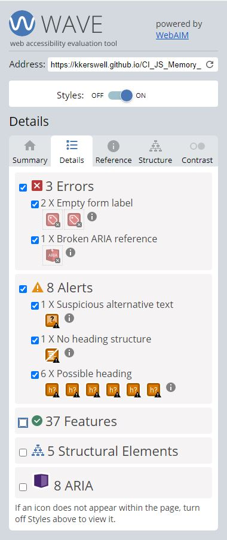

https://code-boxx.com/simple-css-bounce-effect/#sec-extra - bounce

# **
Brain sTRAIN
**

Developer: Keith Kerswell

[Live webpage](https://kkerswell.github.io/CI_JS_Memory_Game/)

## Table of Contents

1. [Project Goals](#project-goals)
    1. [User Goals](#user-goals)
    2. [Site Owner Goals](#site-owner-goals)
2. [User Experience](#user-experience)
    1. [Target Audience](#target-audience)
    2. [User Requrements and Expectations](#user-requrements-and-expectations)
    3. [User Stories](#user-stories)
3. [Design](#Design)
    1. [Design Choices](#design-choices)
    2. [Colour Scheme](#colour-scheme)
    3. [Fonts](#fonts)
    4. [Images and Video](#images-and-video)
    5. [Structure](#structure)
    6. [Wireframes](#wireframes)
4. [Technologies Used](#technologies-used)
    1. [Languages](#languages)
    2. [Frameworks & Tools](#frameworks--tools)
5. [Features](#features)
    1. [Logo and Navigation Bar](#logo-and-navigation-bar)
    2. [Footer](#footer)
    3. [Homepage](#homepage)
    4. [About Us](#about-us)
    5. [Our Animals](#our-animals)
    6. [Fundraising](#fundraising)
    7. [Contact Form](#contact-form)
    8. [Map and address](#map-and-address)
6. [Development](#development)
    1. [Building and Maintaining](#building-and-maintaining)
    2. [Commits](#commits)
    3. [Deployment](#deployment)
    4. [Cloning](#cloning)
7. [Testing](#testing)
    1. [HTML Validation](#html-validation)
    2. [CSS Validation](#css-validation)
    3. [Accessibility](#accessibility)
    4. [Performance](#performance)
    5. [Responsiveness](#responsiveness)
    6. [Browser compatibility](#browser-compatability)
    7. [Testing user stories](#testing-user-stories)
8. [Bugs](#Bugs)
9. [Credits](#credits)
10. [Acknowledgements](#acknowledgements)

## Project Goals 

### User Goals
- Play a fun matching game
- Practice and improve memory
- Contact the site owner
- Find the site owner's social media

### Site Owner Goals
- Attract people who want to play a matching game
- Attract people who want to improve their memory
- Have a way for people to contact us
- Have links to our social media pages

## User Experience

### Target Audience
- People looking to play a game
- People looking to train their memory

### User Requrements and Expectations

- A simple and intuitive navigation system
- Quickly and easily find relevant information
- Links and functions that work as expected
- Good presentation and a visually appealing design regardless of screen size
- An easy way to contact the site owner
- Simple layout with the focus being on the game
- Accessibility

### User Stories

#### First-time User 
1. As a first time user, I want to be able to locate the game easily
2. As a first time user, I want to be able to navigate the site easily
3. As a first time user, I want to be able to contact the site owner
4. As a first time user, I want to know about more about the site owner

#### Returning User
5. As a returning user, I want to be able to locate the game easily
6. As a returning user, I want to be able to navigate the site easily
7. As a returning user, I want to be able to contact the site owner
8. As a returning user, I want to know about more about the site owner

#### Site Owner 
9. As the site owner, I want users to be able to locate the game easily
10. As the site owner, I want users to be able to navigate the site easily
11. As the site owner, I want users to be able to contact us
12. As the site owner, I want the users to be able to know about more about us

## Design

### Design Choices

The webpage was designed with to be exciting and vibrant to set the users expectation for a fun game. There is not a large amount of content on the page as the focus is on the game itself. Due to this, the site was going to be on one page but with sections that the user can navigate through easily.
   
### Colour Scheme
- Create a fun and vibrant colour scheme
- The site will use six colours but four of these make up the background of the page.
- Final palette colours that were chosen were #ff7f00, #00819f, #d9005f, #4da100, #f4f7f5 and #24343f.

### Fonts
- Create a fun look with soft lines
- Final font chosen was Montserrat Alternates by Google Fonts
- Source: https://fonts.google.com/specimen/Montserrat+Alternates?query=Montserrat+Alternates
- Additional font used to get the numbering effect in the 'Instructions' section.
- Source: https://www.fontspace.com/digits-font-f2006

### Images and Video
- For the project, royalty free imagry is required
- Image sources
  - Main Logo - https://www.freepik.com/free-vector/head-profile-with-gears_4347647.htm?query=brain%20icon
  - Back of Card Icons: https://seeklogo.com/vector-logo/319158/brain-shape
  - Front of Card Icons: https://www.vecteezy.com/vector-art/4213194-matching-pairs-geometry-game-memory-training-circle-triangle-square-tile-on-pink-teal-yellow-white-background
  - 404 Error - https://www.freepik.com/free-vector/oops-404-error-with-broken-robot-concept-illustration_13315300.htm

### Structure
The page is structured in a well know, recognisable, user friendly, and easy to learn way. 
    
Upon arriving to the website the user sees a familiar type of navigation bar and footer bar. 
    
The website consists of one page with four sections plus an additional full-screen modal for the game: 
- A main area consisting of the site logo, name and catchphrases.
- An instructions area where the users learn how to play the game.
- A game section which has a button to launch the game in a new modal.
- A contact section with a contact form.

## Wireframes

Main Site (One Page Layout)

Game Area Modal (Full Screen)

## Technologies Used

### Languages
- HTML
- CSS
- Javascript

### Frameworks & Tools
- Git
- GitHub
- Gitpod
- Balsamiq
- Google Fonts
- Font Awsome
- TinyPNG.com
- Favicon.io
- JQuery
- Bootstrap
- EmailJS

## Features
The page consists of one page with a full-screen modal and seven features

### Navigation Bar
- Sticky feature, so it always remains at the top of the page.
- The navbar is fully responsive and includes links to the Main, Instructions, Game and Contact sections.
- It allows users to easily navigate the page
- User stories covered: 3, 11

### Main area
- This area shows a hero image and striking text to give an impactful first impression to the site
- Fully responsive
- User stories covered: 3, 11

### Instructions
- Gives easy to follow instructions
- Fully responsive and changes layout and removes picture on smaller screens
- User stories covered: 3, 11

### Game Button
- Large animated button to draw attention to the user and show it can be interacted with
- Fully responsive
- User stories covered: 2, 6, 10

### Game Modal
- Displays the game in a full-page modal
- Fully responsive
- User stories covered: 4, 7, 9

### Contact Form
- A way for users to contact the site owner
- Fully responsive
- User stories covered: 5, 8, 12

### Footer
- Fully responsive
- Consists of two seperate sections: Copyright information and social media links
- User stories covered: 3, 11

## Development 

### Building and Maintaining

GitHub was used as version control software to maintain, upload and share code with other developers.

GitPod was used to write the code.

### Commits

I kept track of updates by using commits in Git.  The terminal commands for these were:

* git add .
* git commit -m "Description of change"
* git push

### Deployment

The website was deployed to GitHub Pages.

To complete this action I completed the following process:

1. Navigated to my site repository: https://github.com/kkerswell/CI_JS_Memory_Game
2. Clicked on "Settings" within the top navigation area
3. Clicked on "Pages" within the side navigation area
4. Clicked the dropdown box under "Source" and choose "main"
5. Clicked on the "Save" button
6. Once saved, the url is then provided

### Cloning

1. Navigate to repo: https://github.com/kkerswell/CI_JS_Memory_Game
2. Click on the 'Code' button
3. Copy the repository url
4. Navigate to your personal GitHub page
5. Click on the 'Repositories' link at the top of the page
6. Click on the 'New' button
7. Click on 'Import a repository' at the top of the page
8. Pase the repository url from above
9. Name your new repository
10. Click 'Begin Import'

## Testing

### HTML Validation

https://validator.w3.org/ was used to validate HTML.

#### index.html

Picture

 

#### about.html

Picture

 

#### animals.html

Picture

 

#### fundraising.html

Picture

 

#### contactus.html

Picture

 

### CSS Validation

https://jigsaw.w3.org/css-validator/ was used to validate CSS.

Picture

 

### Accessibility

https://wave.webaim.org/ was used to test accessibility.

The results were as follows:

Picture

 

Errors and rationale:

- 1 x No heading structure
  - As the page is very simple, this structuring is not required.

- 6 x Possible heading
  - Not required as adding these would not improve the document structure, outlines, and navigation.

- 2 x Empty form label
  - This has been identified on the checkboxes used for the volume control within the game. Therefore, an expected error.

- 1 x Broken ARIA reference
  - This has been picked up on the modal. It is not a concern as this is provided by Bootstrap.

### Performance

https://developers.google.com/web/tools/lighthouse was used to test performance.

#### index.html

Picture

 

#### about.html

Picture

 

#### animals.html

Picture

 

#### fundraising.html

Picture

 

#### contactus.html

Picture

 

### Responsiveness

http://ami.responsivedesign.is was used to test responsiveness.

#### index.html

Picture

 

#### about.html

Picture

 

#### animals.html

Picture

 

#### fundraising.html

Picture

 

#### contactus.html

Picture

 

### Browser compatibility

The website was tested on the following browsers:

- Google Chrome
- Mozilla Firefox
- Microsoft Egde

### Testing user stories

1. As a first time user, I want to know where the animal shelter is located

| **Feature** | **Action** | **Expected Result** | **Actual Result** |
|-------------|------------|---------------------|-------------------|
| Address | Navigate to the Contact Us page, locate the address | Locating address of the animal shelter | Works as expected |
| Map | Navigate to the Contact Us page, locate the Google Map | Locating a map showing the location of the animal shelter | Works as expected |

Screenshots

 

2. As a first time user, I want to know the animals available for adoption

| **Feature** | **Action** | **Expected Result** | **Actual Result** |
|-------------|------------|---------------------|-------------------|
| Our Animals | Navigate to the Our Animals page | See list of cats and dogs available for adoption | Works as expected |

Screenshots

 

3. As a first time user, I want to know more about the animal shelter

| **Feature** | **Action** | **Expected Result** | **Actual Result** |
|-------------|------------|---------------------|-------------------|
| About Us | Navigate to the About Us page | Find description of the animal shelter | Works as expected |

Screenshots

 

4. As a first time user, I want to know about any fundraising activities

| **Feature** | **Action** | **Expected Result** | **Actual Result** |
|-------------|------------|---------------------|-------------------|
| Upcoming Events | Navigate to the Fundraising page | Find a list of events with dates and descriptions | Works as expected |

Screenshots

 

5. As a first time user, I want to be able to contact the animal shelter

| **Feature** | **Action** | **Expected Result** | **Actual Result** |
|-------------|------------|---------------------|-------------------|
| Contact Us | Navigate to the Contact Us page | Find the form | Works as expected |

Screenshots

 

6. As a returning user, I want to know which animals are available for adoption

| **Feature** | **Action** | **Expected Result** | **Actual Result** |
|-------------|------------|---------------------|-------------------|
| Our Animals | Navigate to the Our Animals page | See list of cats and dogs available for adoption | Works as expected |

Screenshots

 

7. As a returning user, I want to know about any fundraising activities

| **Feature** | **Action** | **Expected Result** | **Actual Result** |
|-------------|------------|---------------------|-------------------|
| Upcoming Events | Navigate to the Fundraising page | Find a list of events with dates and descriptions | Works as expected |

Screenshots

 

8. As a returning user, I want to be able to contact the animal shelter

| **Feature** | **Action** | **Expected Result** | **Actual Result** |
|-------------|------------|---------------------|-------------------|
| Contact Us | Navigate to the Contact Us page | Find the form | Works as expected |

Screenshots

 

9. As the site owner, I want users to find information about upcoming fundraising activities

| **Feature** | **Action** | **Expected Result** | **Actual Result** |
|-------------|------------|---------------------|-------------------|
| Upcoming Events | Navigate to the Fundraising page | Find a list of events with dates and descriptions | Works as expected |

Screenshots

 

10. As the site owner, I want users to find information about available animals ready for adoption

| **Feature** | **Action** | **Expected Result** | **Actual Result** |
|-------------|------------|---------------------|-------------------|
| Our Animals | Navigate to the Our Animals page | See list of cats and dogs available for adoption | Works as expected |

Screenshots

 

11. As the site owner, I want users to get to know the animal shelter

| **Feature** | **Action** | **Expected Result** | **Actual Result** |
|-------------|------------|---------------------|-------------------|
| About Us | Navigate to the About Us page | Find description of the animal shelter | Works as expected |

Screenshots

 

12. As the site owner, I want the users to be able to contact us

| **Feature** | **Action** | **Expected Result** | **Actual Result** |
|-------------|------------|---------------------|-------------------|
| Contact Us | Navigate to the Contact Us page | Find the form | Works as expected |

Screenshots

 

13. As the site owner, I want users to be able to see where we are located.

| **Feature** | **Action** | **Expected Result** | **Actual Result** |
|-------------|------------|---------------------|-------------------|
| Address | Navigate to the Contact Us page, locate the address | Locating address of the animal shelter | Works as expected |
| Map | Navigate to the Contact Us page, locate the Google Map | Locating a map showing the location of the animal shelter | Works as expected |

Screenshots

 

## Problems

- spacing the a links in the nav bar.  I originally tried to add margin and padding but this was having an undesired effect.  I got arround this by adding line-height to the nav a section.
- When Adding a h1 to the header, the alignment of both h1 and nav changed to an undesired style. I struggled to get the h1 to align left and the nav to align right.  I then changed both to display inline but the nav was then aligned right next to the h1 on the right side of the page, when I wanted it on the left. I overcame this by adding float right to the nav.
- When hosting page on GitHub pages, the site did not work correctly.  I had to change all file paths to relative in order for this to work.
- On the index page, I wanted a large full-scale image to cover the screen with a text overlay.  Whilst I managed to achieve this, I found I experienced issues when it came to responsive design. I attempted several fixes but ultimately I decided to change the design of the page to allow for easier coding and responsiveness.
- When trying to style the images in the animal_hero div on the About Us page, I had an issue where the cat image was being pushed off the side of the page. I had to utilise Bootstrap in order to get the styling I wanted for this.

## Credits

Assets used have been credited in the code.  However, the following is a list of external sources that were utilised for this website.

- https://commonmark.org/help/
- https://colorhunt.co/
- https://www.w3schools.com/css/css3_variables.asp
- https://unsplash.com/
- https://fontawesome.com/
- https://fonts.google.com/
- https://stackoverflow.com/
- https://colorhunt.co/
- https://favicon.io/emoji-favicons/dog-face

## Acknowledgements

I would like to take the opportunity to thank:

- My mentor Mo Shami for his feedback, advice, guidance and support.
- The  Code Institute Slack community for providing assistance and peer code reviews.
