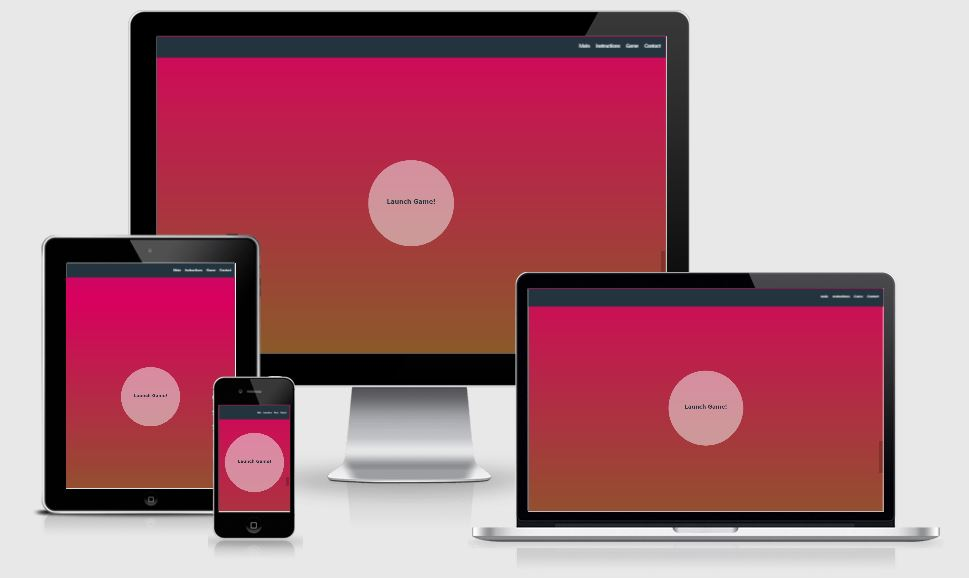

# **
Brain sTRAIN
**

Developer: Keith Kerswell

[Live webpage](https://kkerswell.github.io/CI_JS_Memory_Game/)

## Table of Contents

1. [Project Goals](#project-goals)
    1. [User Goals](#user-goals)
    2. [Site Owner Goals](#site-owner-goals)
2. [User Experience](#user-experience)
    1. [Target Audience](#target-audience)
    2. [User Requrements and Expectations](#user-requrements-and-expectations)
    3. [User Stories](#user-stories)
3. [Design](#design)
    1. [Design Choices](#design-choices)
    2. [Colour Scheme](#colour-scheme)
    3. [Fonts](#fonts)
    4. [Images and Video](#images-and-video)
    5. [Structure](#structure)
    6. [Wireframes](#wireframes)
4. [Technologies Used](#technologies-used)
    1. [Languages](#languages)
    2. [Frameworks & Tools](#frameworks--tools)
5. [Features](#features)
    1. [Navigation Bar](#navigation-bar)
    2. [Main Area](#main-area)
    3. [Instructions](#instructions)
    4. [Game Button](#game-button)
    5. [Game Modal](#game-modal)
    6. [Contact Form](#contact-form)
    7. [Footer](#footer)
    8. [Future Feature](#future-feature)
6. [Development](#development)
    1. [Building and Maintaining](#building-and-maintaining)
    2. [Commits](#commits)
    3. [Deployment](#deployment)
    4. [Cloning](#cloning)
7. [Testing](#testing)
    1. [HTML Validation](#html-validation)
    2. [CSS Validation](#css-validation)
    3. [JS Validation](#js-validation)
    4. [Performance and Accessibility](#performance-and-accessibility)
    5. [Responsiveness](#responsiveness)
    6. [Browser Compatibility](#browser-compatibility)
    7. [Testing User Stories](#testing-user-stories)
8. [Problems](#problems)
9. [Credits](#credits)
10. [Acknowledgements](#acknowledgements)

## Project Goals 

### User Goals
- Play a fun matching game
- Practice and improve memory
- Contact the site owner
- Find the site owner's social media

### Site Owner Goals
- Attract people who want to play a matching game
- Attract people who want to improve their memory
- Have a way for people to contact us
- Have links to our social media pages

## User Experience

### Target Audience
- People looking to play a game
- People looking to train their memory

### User Requrements and Expectations

- A simple and intuitive navigation system
- Quickly and easily find relevant information
- Links and functions that work as expected
- Good presentation and a visually appealing design regardless of screen size
- An easy way to contact the site owner
- Simple layout with the focus being on the game
- Accessibility

### User Stories

#### First-time User 
1. As a first time user, I want to be able to navigate the site easily
2. As a first time user, I want to find instructions on how to play
3. As a first time user, I want to be able to locate the game easily
4. As a first time user, I want to be able to play the game
5. As a first time user, I want to be able to contact the site owner
6. As a first time user, I want to access the site owner's social media

#### Returning User
7. As a returning user, I want to be able to navigate the site easily
8. As a first time user, I want to find instructions on how to play
9. As a first time user, I want to be able to locate the game easily
10. As a first time user, I want to be able to play the game.
11. As a first time user, I want to be able to contact the site owner
12. As a first time user, I want to access the site owner's social media

#### Site Owner 
13. As the site owner, I want users to be able to navigate the site easily
14. As the site owner, I want users to be able to find instructions on how to play
15. As the site owner, I want users to be able to locate the game easily
16. As the site owner, I want users to be able to play the game.
17. As the site owner, I want users to be able to contact us
18. As the site owner, I want users to be able to have links to our social media

## Design

### Design Choices

The webpage was designed with to be exciting and vibrant to set the users expectation for a fun game. There is not a large amount of content on the page as the focus is on the game itself. Due to this, the site was going to be on one page but with sections that the user can navigate through easily.
   
### Colour Scheme
- Create a fun and vibrant colour scheme
- The site will use six colours but four of these make up the background of the page.
- Final palette colours that were chosen were #ff7f00, #00819f, #d9005f, #4da100, #f4f7f5 and #24343f.

### Fonts
- Create a fun look with soft lines
- Final font chosen was Montserrat Alternates by Google Fonts
- Source: https://fonts.google.com/specimen/Montserrat+Alternates?query=Montserrat+Alternates
- Additional font used to get the numbering effect in the 'Instructions' section.
- Source: https://www.fontspace.com/digits-font-f2006

### Images and Video
- For the project, royalty free imagry is required
- Image sources
  - Main Logo - https://www.freepik.com/free-vector/head-profile-with-gears_4347647.htm?query=brain%20icon
  - Back of Card Icons: https://seeklogo.com/vector-logo/319158/brain-shape
  - Front of Card Icons: https://www.vecteezy.com/vector-art/4213194-matching-pairs-geometry-game-memory-training-circle-triangle-square-tile-on-pink-teal-yellow-white-background
  - 404 Error - https://www.freepik.com/free-vector/oops-404-error-with-broken-robot-concept-illustration_13315300.htm

### Structure
The page is structured in a well know, recognisable, user friendly, and easy to learn way. 
    
Upon arriving to the website the user sees a familiar type of navigation bar and footer bar. 
    
The website consists of one page with four sections plus an additional full-screen modal for the game: 
- A main area consisting of the site logo, name and catchphrases.
- An instructions area where the users learn how to play the game.
- A game section which has a button to launch the game in a new modal.
- A contact section with a contact form.

### Wireframes

Main Site (One Page Layout)

Game Area Modal (Full Screen)

## Technologies Used

### Languages
- HTML
- CSS
- Javascript

### Frameworks & Tools
- Git
- GitHub
- Gitpod
- Balsamiq
- Google Fonts
- Font Awsome
- TinyPNG.com
- Favicon.io
- JQuery
- Bootstrap
- EmailJS

## Features
The page consists of one page with a full-screen modal and seven features

### Navigation Bar
- Sticky feature, so it always remains at the top of the page.
- The navbar is fully responsive and includes links to the Main, Instructions, Game and Contact sections.
- It allows users to easily navigate the page
- User stories covered: 1, 7, 13

### Main area
- This area shows a hero image and striking text to give an impactful first impression to the site
- Fully responsive

### Instructions
- Gives easy to follow instructions
- Fully responsive and changes layout and removes picture on smaller screens
- User stories covered: 2, 8, 14

### Game Button
- Large animated button to draw attention to the user and show it can be interacted with
- Fully responsive
- User stories covered: 3, 9, 15

### Game Modal
- Displays the game in a full-page modal
- Fully responsive
- User stories covered: 4, 10, 16

### Contact Form
- A way for users to contact the site owner
- Fully responsive
- User stories covered: 5, 11, 17

### Footer
- Fully responsive
- Consists of two seperate sections: Copyright information and social media links
- User stories covered: 6, 12, 18

### Future Feature
- A planned future realease would include an option given to the user on each level victory where they can choose to either close the game or continue to next level.
- Optional: Include countdown timer within this feature to automatically launch the next level if no user inputs are detected.  

## Development 

### Building and Maintaining

GitHub was used as version control software to maintain, upload and share code with other developers.

GitPod was used to write the code.

### Commits

I kept track of updates by using commits in Git.  The terminal commands for these were:

* git add .
* git commit -m "Description of change"
* git push

### Deployment

The website was deployed to GitHub Pages.

To complete this action I completed the following process:

1. Navigated to my site repository: https://github.com/kkerswell/CI_JS_Memory_Game
2. Clicked on "Settings" within the top navigation area
3. Clicked on "Pages" within the side navigation area
4. Clicked the dropdown box under "Source" and choose "main"
5. Clicked on the "Save" button
6. Once saved, the url is then provided

### Cloning

1. Navigate to repo: https://github.com/kkerswell/CI_JS_Memory_Game
2. Click on the 'Code' button
3. Copy the repository url
4. Navigate to your personal GitHub page
5. Click on the 'Repositories' link at the top of the page
6. Click on the 'New' button
7. Click on 'Import a repository' at the top of the page
8. Pase the repository url from above
9. Name your new repository
10. Click 'Begin Import'

## Testing

### HTML Validation

https://validator.w3.org/ was used to validate HTML.

#### index.html

Picture

 

### CSS Validation

https://jigsaw.w3.org/css-validator/ was used to validate CSS.

#### style.css

Picture

 

#### game.css

Picture

 

### JS Validation

https://jshint.com/ was used to validate Javascript

#### sendEmail.js

Picture

 

#### game.js

Picture

 

Picture

 

### Performance and Accessibility

https://developers.google.com/web/tools/lighthouse was used to test performance.

#### index.html

Picture

 

### Responsiveness

http://ami.responsivedesign.is was used to test responsiveness.

#### Main

Picture

 

#### Instructions

Picture

 

#### Game Button

Picture

 

#### Game Modal

Picture

 

#### Contact

Picture

 

#### Footer

Picture

 

### Browser Compatibility

The website was tested on the following browsers:

- Google Chrome
- Mozilla Firefox
- Microsoft Egde

### Testing User Stories

1. As a first time user, I want to be able to navigate the site easily

| **Feature** | **Action** | **Expected Result** | **Actual Result** |
|-------------|------------|---------------------|-------------------|
| Navigation Bar | Always visible | Stuck to the top of the viewport | Works as expected |

Screenshots

 

2. As a first time user, I want to find instructions on how to play

| **Feature** | **Action** | **Expected Result** | **Actual Result** |
|-------------|------------|---------------------|-------------------|
| Instructions | Navigate to the Instructions | Find the Instructions | Works as expected |

Screenshots

 

3. As a first time user, I want to be able to locate the game easily

| **Feature** | **Action** | **Expected Result** | **Actual Result** |
|-------------|------------|---------------------|-------------------|
| Navigation Bar | Stuck to the top of the viewport, click Game | Page navigates to Game button | Works as expected |
| Game Button | Navigate to the Game Button | See a clearly visible button | Works as expected |

Screenshots

 

4. As a first time user, I want to be able to play the game

| **Feature** | **Action** | **Expected Result** | **Actual Result** |
|-------------|------------|---------------------|-------------------|
| Game Modal | Click the Launch Game! button  | Modal opens in full screen with game ready to play | Works as expected |

Screenshots

 

5. As a first time user, I want to be able to contact the site owner

| **Feature** | **Action** | **Expected Result** | **Actual Result** |
|-------------|------------|---------------------|-------------------|
| Contact Form | Navigate to the Contact Form | Find the form | Works as expected |

Screenshots

 

6. As a first time user, I want to access the site owner's social media

| **Feature** | **Action** | **Expected Result** | **Actual Result** |
|-------------|------------|---------------------|-------------------|
| Footer | Navigate to the Footer | Find the Social Media links | Works as expected |

Screenshots

 

7. As a returning user, I want to be able to navigate the site easily

| **Feature** | **Action** | **Expected Result** | **Actual Result** |
|-------------|------------|---------------------|-------------------|
| Navigation Bar | Always visible | Stuck to the top of the viewport | Works as expected |

Screenshots

 

8. As a first time user, I want to find instructions on how to play

| **Feature** | **Action** | **Expected Result** | **Actual Result** |
|-------------|------------|---------------------|-------------------|
| Instructions | Navigate to the Instructions | Find the Instructions | Works as expected |

Screenshots

 

9. As a first time user, I want to be able to locate the game easily

| **Feature** | **Action** | **Expected Result** | **Actual Result** |
|-------------|------------|---------------------|-------------------|
| Navigation Bar | Stuck to the top of the viewport, click Game | Page navigates to Game button | Works as expected |
| Game Button | Navigate to the Game Button | See a clearly visible button | Works as expected |

Screenshots

 

10. As a first time user, I want to be able to play the game

| **Feature** | **Action** | **Expected Result** | **Actual Result** |
|-------------|------------|---------------------|-------------------|
| Game Modal | Click the Launch Game! button  | Modal opens in full screen with game ready to play | Works as expected |

Screenshots

 

11. As a first time user, I want to be able to contact the site owner

| **Feature** | **Action** | **Expected Result** | **Actual Result** |
|-------------|------------|---------------------|-------------------|
| Contact Form | Navigate to the Contact Form | Find the form | Works as expected |

Screenshots

 

12. As a first time user, I want to access the site owner's social media

| **Feature** | **Action** | **Expected Result** | **Actual Result** |
|-------------|------------|---------------------|-------------------|
| Footer | Navigate to the Footer | Find the Social Media links | Works as expected |

Screenshots

 

13. As the site owner, I want users to be able to navigate the site easily

| **Feature** | **Action** | **Expected Result** | **Actual Result** |
|-------------|------------|---------------------|-------------------|
| Navigation Bar | Always visible | Stuck to the top of the viewport | Works as expected |

Screenshots

 

14. As the site owner, I want users to be able to find instructions on how to play

| **Feature** | **Action** | **Expected Result** | **Actual Result** |
|-------------|------------|---------------------|-------------------|
| Instructions | Navigate to the Instructions | Find the Instructions | Works as expected |

Screenshots

 

15. As the site owner, I want users to be able to locate the game easily

| **Feature** | **Action** | **Expected Result** | **Actual Result** |
|-------------|------------|---------------------|-------------------|
| Navigation Bar | Stuck to the top of the viewport, click Game | Page navigates to Game button | Works as expected |
| Game Button | Navigate to the Game Button | See a clearly visible button | Works as expected |

Screenshots

 

16. As the site owner, I want users to be able to play the game

| **Feature** | **Action** | **Expected Result** | **Actual Result** |
|-------------|------------|---------------------|-------------------|
| Game Modal | Click the Launch Game! button  | Modal opens in full screen with game ready to play | Works as expected |

Screenshots

 

17. As the site owner, I want users to be able to contact us

| **Feature** | **Action** | **Expected Result** | **Actual Result** |
|-------------|------------|---------------------|-------------------|
| Contact Form | Navigate to the Contact Form | Find the form | Works as expected |

Screenshots

 

18. As the site owner, I want users to be able to have links to our social media

| **Feature** | **Action** | **Expected Result** | **Actual Result** |
|-------------|------------|---------------------|-------------------|
| Footer | Navigate to the Footer | Find the Social Media links | Works as expected |

Screenshots

 

## Problems

- Adding new levels to the game.  I tried researching online how I could to this.  However, as this was code used from a tutorial I saw, this was difficult. I had to resort to asking for tutor support and got the right idea from the second tutor. I was also then able to make more significant changes such as changing the difficulties by lowering the time.
- Making the game area fully responsive. This was difficult as I was working with new CSS featurs that I hadn't used before. I tried using bootstrap but this did not fix the issue. I had to resort to asking for tutor support and after talking it through with them, I was able to solve part of the issue myself but took their advice onboard for adding media queries as well.
- I wanted to add a feature where, depending on which section of the page the user was currently in, the navbar items at the top of the page would have an indicator on them.  I used JS to achieve this and had various levels of success but ultimately could not get it to function as I wanted.  Given the page is easy to navigate and not much time would be spent by the user on the page itself (as opposed to being within the game area) I felt it was not worth the time investment to troubleshoot this feature further and so removed it entirely.
- When the user is playing a game, if they click exit then a confirmation box will pop up asking them to confirm exit. I was unable to pause the game countdown whilst this box was active.

## Credits

The following is a list of external sources that were utilised for this website.

- https://fontawesome.com/
- https://fonts.google.com/
- https://www.freepik.com/
- https://seeklogo.com/
- https://www.vecteezy.com/
- https://www.freepik.com/
- https://www.youtube.com/watch?v=28VfzEiJgy4
- https://www.youtube.com/watch?v=3uuQ3g92oPQ
- https://code-boxx.com/simple-css-bounce-effect/#sec-extra

## Acknowledgements

I would like to take the opportunity to thank:

- My mentor Rohit Sharma for all the feedback, advice, guidance and support.
- Code Institute tutor support for their time and coding support.
